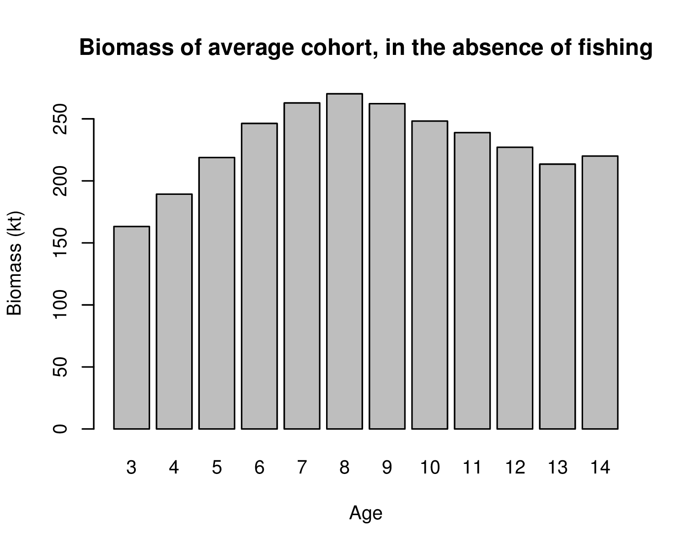

> ICES CM 2019/P:590

# Should we fish younger or older cod?

*Arni Magnusson, Jacob Kasper, Cecilia Pinto, Paris Vasilakopoulos,
Alejandro Yáñez, Knut Korsbrekke, David Miller*

## Abstract

Fisheries stock assessment and management advice mainly focuses on the overall
fishing pressure and annual catches in tonnes. Much less attention is paid to
selectivity, whether it would be advisable to shift the fishery towards younger
or older fish. In this study, we look at the main Atlantic cod stocks in
European and North American waters (*n* = 15) and evaluate the likely effects of
shifting the selectivity towards younger or older fish. The analytical approach
incorporates the life history, stock size, and average catch composition from
each fishery in recent years. The majority of cod fished in the North Sea and
Celtic Seas tend to be at age 1 and 2, while ages 5 and 6 are most common in the
catches of Northeast Arctic and Icelandic cod, with the other cod stocks
somewhere in between. The stocks that are fished at the youngest ages are also
the stocks with the fastest somatic growth rate. Essentially all the Atlantic
cod fisheries would benefit from shifting the selectivity to older fish, with a
predicted increase in both the annual yield and spawning biomass in the long
term. A similar analytical approach could be used to evaluate the likely effects
of shifting the selectivity of other fish species sharing habitat with the cod.

## Download

* [Poster](https://github.com/ices-eg/wg_MGWG/releases/download/asc2019/poster.pdf)
* [More figures](https://github.com/ices-eg/wg_MGWG/releases/download/asc2019/morefigs.pdf)
* [Abstract](https://github.com/ices-eg/wg_MGWG/releases/download/asc2019/abstract.pdf)

## Browse

* [MGWG on ices.dk](http://www.ices.dk/community/groups/Pages/MGWG.aspx)
* [Code on GitHub](https://github.com/ices-eg/wg_MGWG/tree/master/selectivity/R)

***

# Selectivity as part of management advice

Coordinators: Arni Magnusson, Jacob Kasper

## Participants

Arni Magnusson, Jacob Kasper, Cecilia Pinto, Paris Vasilakopoulos, Alejandro
Yanez, Knut Korsbrekke, David Miller

*May join later: Daniel Howell, Michael Schirripa, Tim Earl*

## Background

Looking across many stocks of Atlantic cod, we see very different selectivities:
some are fished mainly at ages 1-3, other stocks mainly at ages 4-8. This has
not been the result of scientific advice, but gear regulations that have evolved
in each region.

Can this be considered mismanagement of some of these cod stocks, in the form of
underutilizing or risking stock collapse? Or are the different selectivities
quite sensible, given the growth and maturity ogives for the respective stocks?

## Objective

To evaluate whether some Atlantic cod fisheries could be improved (in terms of
long-term yield, sustainability, precautionary approach, etc.) by changing the
selectivity. In other words, provide an analytical foundation that could lead to
scientific advice to change gear regulations.

With relatively little amount of work, we can give an important and useful
summary/comparison of many Atlantic cod fisheries. A follow-up study could
repeat the analysis for different species found in mixed fisheries on a regional
basis.

Research questions:

* What are the long-term impacts of a given selectivity pattern?

* What should selectivity be optimized for? (Yield, economics, sustainability,
  CPUE)

* Which fisheries are not using an optimal selectivity pattern and what are the
  impacts of these decisions?

* Does using too young of an age plus group mask important nuances of
  selectivity patterns?

## Plan

1. Gather data for as many Atlantic cod stocks as possible (by year and age):
   * Weight
   * Maturity
   * Natural mortality
   * Fishing mortality
   * Population numbers

2. Within-stock analysis:
   * Calculate averages - weight, maturity, selectivity, recruitment
   * Biomass of average cohort, in the absence of fishing (barplot)
   * Identify optimal age of harvest (highest column in barplot)
   * Compare with selectivity
   * Calculate optimal Fbar for this stock, given constant recruitment
   * Evaluate how selectivity could be changed to improve this cod fishery,
     by sliding the selectivity pattern towards younger or older fish

3. Across-stocks analysis:
   * Compare all stocks, using summary statistics and composite plots

## Tasks

Cod stock     | Data        | CSB plots | Potential | Historical
------------- | ----------- | --------- | --------- | ----------
(R functions) |             | Arni      | Arni      | Cecilia
---           | -           | ***       |           |
Faroe Plateau | Jacob       | Jacob     |           | Cecilia
Georges Bank  | Jacob       | Jacob     |           |
Gulf of Maine | Jacob       | Jacob     |           |
Iceland       | Arni        | Alejandro |           |
NE Arctic     | Jacob       | Jacob     |           |
North Sea     | Arni        | Arni      |           |
W Baltic      | Cecilia     | Jacob     |           |

*CSB plots* show C=catch at age, S=selectivity, and B=biomass of cohort in the
absence of fishing

*Potential yield* is calculated using the [applyFmax](R/functions/applyFmax.R)
function, using a variety of selectivity curves with different
[A50](R/functions/A50.R) values

*Historical analysis* looks at long-term changes in weights, maturity, and
selectivity

## Literature

*Specific topics*

* Papers on Lopt, optimal length at capture (Paris)

* Papers where Norwegian fisheries managers ask for analysis/advice on
  selectivity (Daniel)

*Links*
* [Brunel and Piet 2013](https://doi.org/10.1093/icesjms/fss184) The current
  paradigm in fishery management consists of promoting selective fishing in
  order to protect the youngest fish to let them grow and have the opportunity
  to reproduce before being caught.
* [Diekert, 2010](https://folk.uio.no/floriakd/papers/Diekert2010_ERE.pdf)
  "the current exploitation pattern implies that essentially the wrong fish are
  targeted. Catching older and heavier fish could double the fishery’s
  Net-Present-Value."
* [Jørgensen et al. 2009](https://www.ncbi.nlm.nih.gov/pmc/articles/PMC3352490/)
* [Caddy and Seijo 2002](https://www.sciencedirect.com/science/article/pii/S0165783602000115)
  argues to protect the largest (especially female) fish
* [CAPAM](http://capamresearch.org/current-projects/selectivity)
* [CAPAM workshop report](https://swfsc.noaa.gov/publications/CR/2013/2013Crone.pdf)
* [Francis 2017](http://www.sciencedirect.com/science/article/pii/S0165783616301953)
* [Froese et al. 2008](http://www.sciencedirect.com/science/article/pii/S016578360800043X)
Paper on Lopt
* [Froese et al. 2016a](https://doi.org/10.1093/icesjms/fsv122)
Looks at balanced harvesting of sizes, and proposes sustainable and low-impact
fishing instead.
* [Froese et al. 2016b](https://onlinelibrary.wiley.com/doi/abs/10.1111/faf.12146)
Proposing new equations for Lopt and Aopt
* [Garcia et al. 2012](http://science.sciencemag.org/content/335/6072/1045)
  argues balanced harvest
* [Hixon et al. 2014](https://academic.oup.com/icesjms/article/71/8/2171/748104)
  argues to protect the largest (especially female) fish
* [Kindsvater et al. 2017](onlinelibrary.wiley.com/doi/10.1111/faf.12208/abstract)
* [Law et al. 2012](https://academic.oup.com/icesjms/article/69/4/602/634795)
  argues balanced harvest
* [Vasilakopoulos et al. 2016](http://onlinelibrary.wiley.com/doi/10.1111/faf.12117/abstract)
  "Currently, MSY and FMSY are usually calculated keeping selectivity constant
  (ICES 2011). Our meta-analysis, in line with previous stock-specific studies
  (e.g. Froese et al. 2008; Scott and Sampson 2011; Colloca et al. 2013),
  suggests that this traditional calculation of MSY is very restrictive in that
  it ignores the higher MSYs that can be extracted by shifting selectivity
  towards older/larger fish."
* [STECF 2015](https://stecf.jrc.ec.europa.eu/documents/43805/935868/STECF+15-05+-+Technical+Measures+part+III.pdf)
  Technical measures report. Page 47: Trade-offs between selectivity and F for
  hake. "Increasing size/age-at-selection allows greater exploitation rates and
  greater yields to be extracted at lower levels of stock depletion."
* [Vasilakopoulos et al. 2014](https://www.cell.com/current-biology/abstract/S0960-9822(14)00671-X)
  "an optimal exploitation regime is more than a single value of F applied at an
  optimal selectivity level. Rather, there is a species-specific continuum of
  optimal combinations of F and selectivity corresponding to areas of high
  long-term yield and SSB."
* [Scott and Sampson 2011](https://ideas.repec.org/a/eee/marpol/v35y2011i1p79-84.html)
  "The results illustrate the potential extent of variation in MSY and the
  corresponding fishing mortality required to achieve it (FMSY) that may result
  solely due to changes in population selectivity. They show that relatively
  subtle changes in selection can produce substantial differences in MSY and
  FMSY."
* [Sampson and Scott 2012](https://onlinelibrary.wiley.com/doi/abs/10.1111/j.1467-2979.2011.00417.x)
  An exploration of the shapes and stability of population–selection curves.
  "For all 15 stocks, the population–selection curves were not stable through
  time but underwent changes in shape, which in some cases were quite radical."
* [Sampson 2014](https://doi.org/10.1016/j.fishres.2013.10.004)
  Fishery selection (selectivity) measures relative fishing mortality-at-age.
  Fishing gear and the locations of the fish and the fishing influence selectivity.
  VPA estimates indicate diverse selectivity curve shapes and temporal variability.
  Selectivity influences fishery performance and stock assessments.
* [O'Boyle et al. 2016](https://academic.oup.com/icesjms/article/73/7/1774/2458751)
  "Building simulations that reflect the life history of the stock can guide assessment efforts by
  placing priors and constraints on model fits to selectivity patterns and be used to explore trade-offs
  between model complexity and the ability to produce reasonable management advice. Their development is
  encouraged as a standard feature in the assessment of migratory fish stocks." Expands on Sampson's
  work.
* [Vasilakopoulos et al. 2020](https://doi.org/10.1111/faf.12117)

*Less relevant for our study...*

* [Fauconnet et al. 2016](https://www.sciencedirect.com/science/article/pii/S0308597X15003231)

## Appendix

*Preliminary plot, from Icelandic cod analysis*

***

## Calendar - web meetings

We will have a Skype call the second Thursday of every month until the next MGWG
meeting. We will organize tasks to be completed prior to each meeting.

**11 Oct 2018** 4pm (CEST, UTC+2)

1. Examine, summarize, and interpret the results so far
2. Review gaps in data, identify stocks that could be added
3. Status update on side stories (Lopt, Norwegian literature, historical
   changes)
4. Prepare a list of next tasks, decide who will report on what next meeting

[minutes](minutes.md#11-oct-2018)

~~08 Nov 2018~~

~~13 Dec 2018~~

**10 Jan 2019** 4pm (CET, UTC+1)

1. Overview of datasets, recently added stocks, summary plots
2. Profile results from `applyFmax` and `applyF0.1` across all stocks, shifting
   selectivity to younger/older fish, effects on catch and SSB
3. Summarize the results, by focusing on the effect of shifting one year up or
   down
4. Comparison of maturity and selectivity

[minutes](minutes.md#10-jan-2019)

~~14 Feb 2019~~

**14 Mar 2019** 4pm (CET, UTC+1)

**11 Apr 2019** 4pm (CEST, UTC+2)

**09 May 2019** 4pm (CEST, UTC+2)

**13 Jun 2019** 4pm (CEST, UTC+2)

**11 Jul 2019** 4pm (CEST, UTC+2)

**08 Aug 2019** 4pm (CEST, UTC+2)

**12 Sep 2019** 4pm (CEST, UTC+2)
