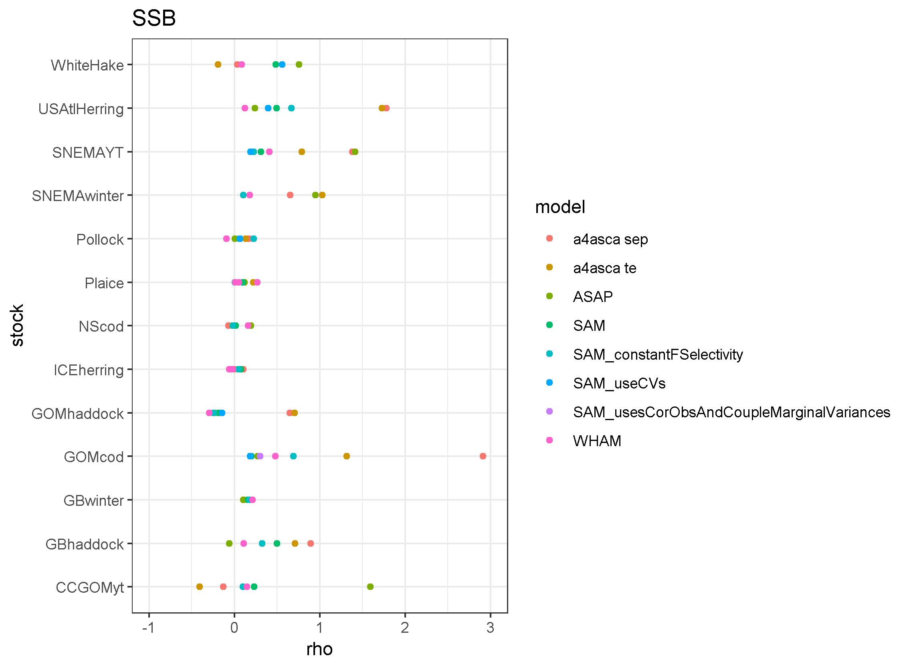
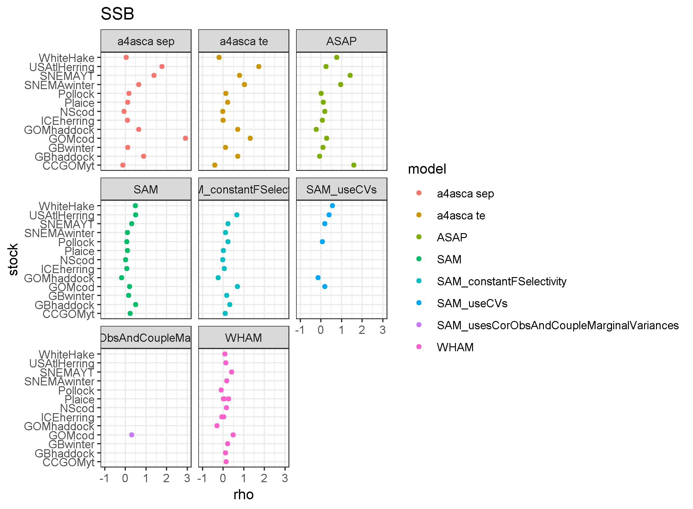
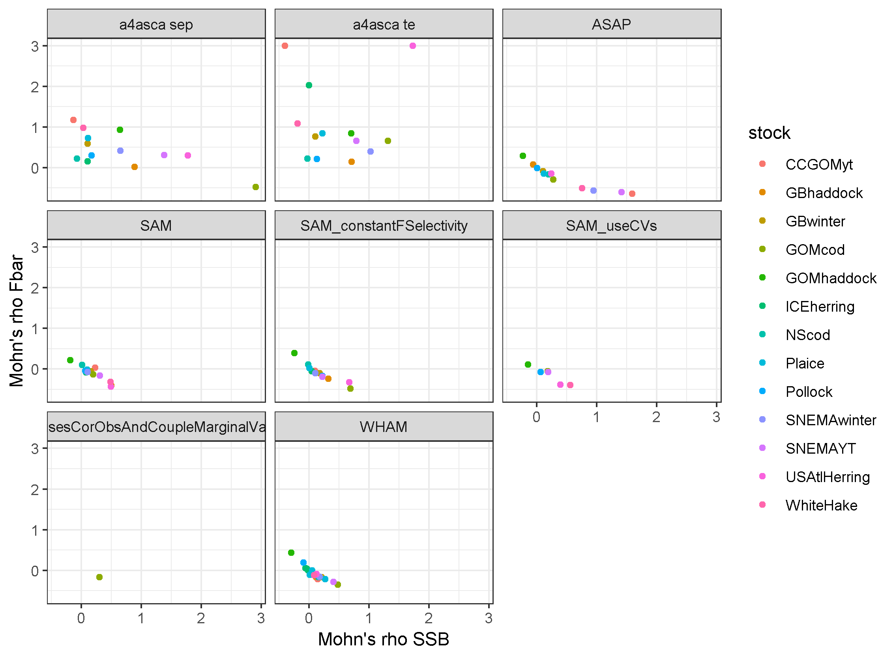
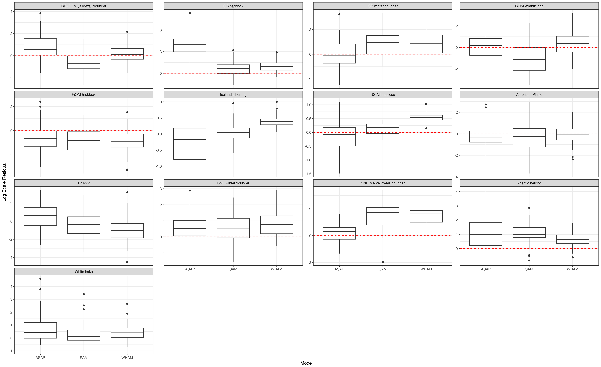
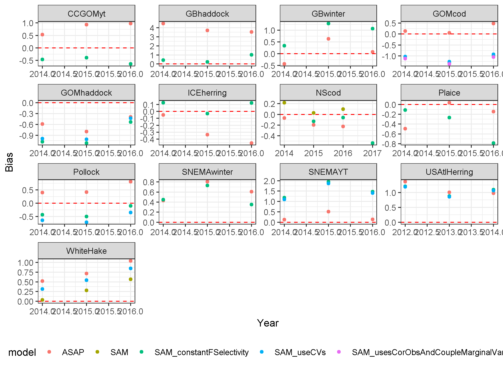
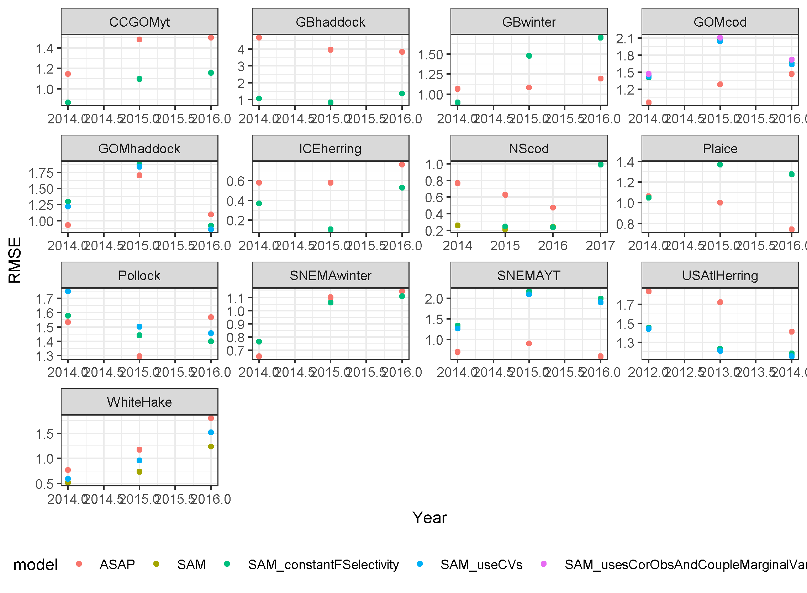
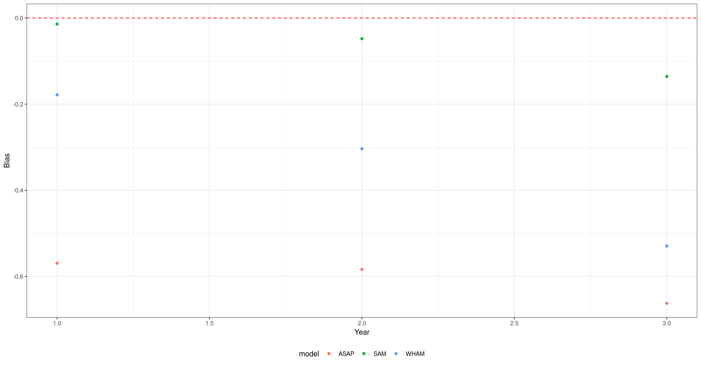
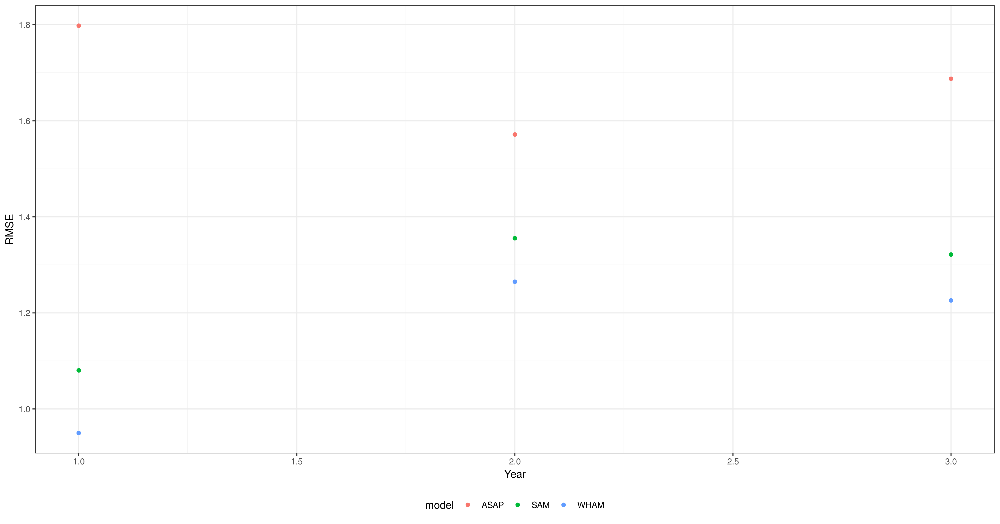

# What's in this directory?

Results from ../helper_code/makedb.r code. There are three sections based on the three files created by each model for each stock. Mohn's rho analysis uses a five year peel for SSB, Fbar, and Recruitment to examine the stability of estimates for each model/stock combination using the Mohn.txt files. The time series of SSB, Fbar, Recruitment, and Catch estimates, along with their confidence intervals, are compared for each stock across all models to look for consistency in population dynamics using the tab1.csv files. The final comparison examines the ability of each model to predict the indices in the recent three years when the observations are removed from the input data using the tab2.csv files. 

## Mohn's rho analysis

The Mohn's rho values for all model/stock combinations are available in the file Mohnrhodb.csv. In the graphs, Mohn's rho values greater than 3 are shown at the value 3, see the csv file for the actual value. Each metric (SSB, Fbar, and Recruitment) is presented two ways, first with all models on the same plot and second with each model a separate tile. Note that a4asca has two tiles, one for the sep case and the other for the te case, while SAM has four variations that are shown separately, and WHAM has multiple models for two stocks (Plaice and ICEherring) that are shown in the same tile. 

 

As an example, the Mohn's rho plot for SSB shows a wide range of values across some models (e.g., USAtlHerring) while other models are much more consistent (e.g., Pollock). 

Tiling the plot shows that the a4asca and ASAP models generally have higher Mohn's rho values than SAM or WHAM models. The general trend is for positive SSB and negative Fbar Mohn's rho values with a strong relationship between the two, except for a4asca models which are less related.

## Time series

The time series of SSB, Fbar, Recruitment, and Catch estimated by each model for each stock are available in the file timeseriesdb.csv. Similar to the Mohn's rho analysis, plots are made of all models for a given metric together and then tiled by model. The ASAP Catch time series do not include confidence intervals because this is not a standard output of the model. The 104 plots are provided in the timeseriesplots.pdf file. Generally, the models estimate similar trends for a given stock and metric, with occasional outliers (e.g., ASAP SSB for Plaice and a4asca te Fbar for USAtlHerring) that are due to the use of vanilla settings for the models. These results raise the question whether it would be better to go back and change the settings for these cases or keep them as is to demonstrate the difficulty of vanilla settings for models? Another general result is that ASAP tends to have tighter confidence intervals than the other models, most likely due to the use of single logistic selectivity curves for all years in all models. There are also some scaling differences among the models, almost certainly due to different treatments of selectivity among the models.

## Missing index prediction

The recent three years of removed observed survey values on log scale and the predictions from the models for all stocks are available in the file predmissingdb.csv. The standard deviation of the prediction for models other than ASAP are also available. Please note, as of writing this readme file, a4asca had not provided the tab2.csv results, these will be incorporated once they become available. Also please note, the WHAM results have incorrect year values in the csv file and so are not currently plotted. These results will be added once the year values are fixed. Finally, please note the SAM results had the fleet index reduced by one to match the other models because SAM assumes fleet one is the catch. For each stock, the observed and predicted values are plotted by model in the file predmisssing_obsprd.pdf. These 13 plots show general difficulty with predicting the missing indices across all models and could be improved by addition of the uncertainty in the predictions using the sdprd variable (on the to do list). In these plots, ages are in columns and indices are in rows. There are some trends over age seen in some stocks across all models (e.g., SNEMAwinter) while other stocks show differences among the models (e.g., Pollock). Residuals (predicted minus observed) are shown as boxplots in the following graph where the model number is shown in the title.

The distribution of residuals for SAM and WHAM models are often quite similar, but different from ASAP. The mean of the residual distributions is plotted as the bias for each model across all indices and years of missing indices, where the horizontal red dashed line shows a bias of zero in this plot.

The square root of the mean of the squared residuals (RMSE) is smaller for better fitting models and does not show a consistent pattern across models among the stocks.

However, when you look at results averaged across stocks we see that SAM and WHAM provide less biased and more accurate predictions in each year of prediction.

But these averages are driven by a single stock (GB haddock), as seen by comparing boxplots for bias

and RMSE. So overall, there is not much difference among the models.

## Other thoughts?

Please feel free to add your observations or new ways of plotting the results to this directory.
