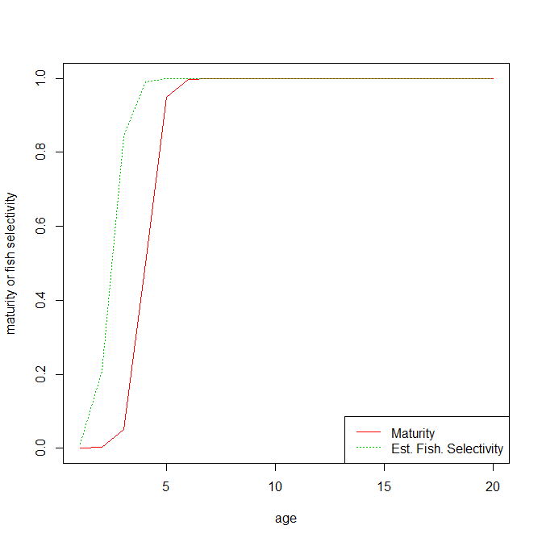
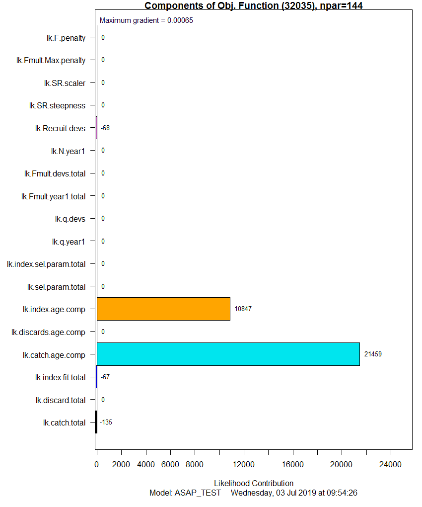
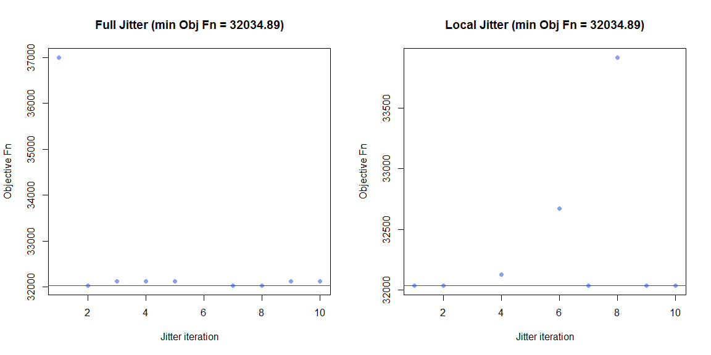

# ASAP fit to true data set
ASAP estimates are reasonably close to the true simulated data, with the exception of the very end of the time series.

True vs estimated SR parameters

| Parameter | True Value     | Estimated Value Mean [95% CI|
|:---------:|---------------:|----------------:|
| steepness | 0.65           |   0.75  [0.66 - 0.84]        |
| SSB0      | 1000           |   886  [755, 1018]     |

Given a value of unfished spawners per recruit of 2.3702, true R0 is 422.  The estimate of R0 from ASAP is 374.

Fishery selectivity is estimated as below, indicating that some fish are selected prior to full maturity.

## ASAP diagnostics

The components of the objective function are: 

The parameter estimates of this fit were jittered 10 times from the final .par file to explore the solution surface near the estimates.  A second restart (n=10) exploring the full parameter space was conducted, again to verify that a global rather than local minimum was obtained.  Both exercises confirmed that the ASAP result had the lowest objective function value.  

Full diagnostics can be found in ASAP_TEST.ALL.PLOTS.pdf.

