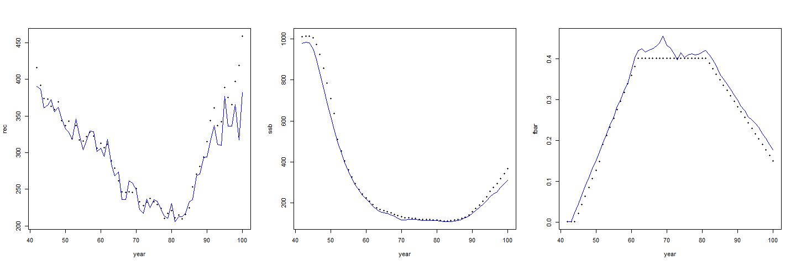

# ASAP fit to true data set
ASAP estimates are reasonably close to the true simulated data, with the exception of the very end of the time series.

True vs estimated SR parameters

| Parameter | True Value     | Estimated Value [95% CI|
|:---------:|---------------:|----------------:|
| steepness | 0.65           |   0.75  [0.66 - 0.84]        |
| SSB0      | 1000           |   883.831  [752.378, 1015.344]     |

